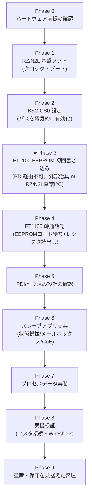

# 実装ロードマップ：RZ/N2L 上で ET1100 を EtherCAT スレーブとして動かすまで

[← 目次](README.md)

ソフトウェア担当が「何を、どの順番で、何が終わったら次に進めるか」を判断できるように、
これまでの調査（[ET1100/docs/](.) と [rzn2l/docs/](../../rzn2l/docs/)）を1本の実装手順に
まとめたものです。各フェーズは「目的」「やること」「完了条件」「詰まりやすい点」を持ち、
詳細は既存ドキュメントへのリンクに委ねています。

## 全体像

**ユーザー想定の流れ「BSC設定→ET1100疎通確認→EEPROM書き込み(初回のみ)→ET1100初期設定」に
対する重要な訂正**: **EEPROM の初回書き込みは、意味のある疎通確認より前に済ませる必要が
あります。** ET1100 は EEPROM の内容が正しく読み込まれるまで PDI（今回のRZ/N2Lとの
非同期バス）自体を活性化しないため、ブランクな EEPROM の状態では「疎通確認」をしようにも
ET1100 が反応しません（詳細はPhase 3参照）。この点を除けば、大枠の理解は正しいです。

---

## Phase 0: ハードウェア前提の確認

ソフトウェア作業に入る前に、以下が完了していることを確認する（本ロードマップの範囲外だが、
前提が崩れているとどのフェーズも進まないため最初に確認）。

- [ ] ET1100 が RZ/N2L の BSC CS0 に接続されている（[ET1100/docs/03_rzn2l_bus_interface.md](03_rzn2l_bus_interface.md) の方式A：`ADR[0]`/`BHE`をGND固定、`WE0#`/`WE1#`をANDゲートで`WR`に、`WAIT#`↔`BUSY`接続、1bitオフセットのアドレス配線）
- [ ] SII EEPROM（I²C、1Kbit以上）が ET1100 の `EEPROM_CLK`/`EEPROM_DATA` に接続されている
- [ ] EtherCAT ポート用の PHY（MII/RMII/RGMII、または EBUS）が接続されている（[ET1100/docs/02_et1100_overview.md](02_et1100_overview.md) §2.9、`an_phy_selection_guidev3.2.pdf`）
- [ ] `RESET` ネットが ET1100・PHY・RZ/N2L で共有されている（推奨構成）
- [ ] **EEPROM の初回書き込み方式を決めている**（Phase 3で必須。下記のいずれか）:
      - **方式(a) 外部治具**: ポゴピン等で `EEPROM_CLK`/`EEPROM_DATA` に直接アクセスできる
        書き込み治具（ベンチプログラマ／量産テスト設備）を用意する。RZ/N2L側の追加配線は不要
      - **方式(b) RZ/N2L自己プロビジョニング**: RZ/N2L の I2C(IIC) チャネルの1つを
        ET1100とは別に `EEPROM_CLK`/`EEPROM_DATA` へ直接配線する（ET1100を`RESET`保持中に
        RZ/N2L自身がI²Cマスタとして書き込む。外部治具不要だが配線とドライバ実装が増える）
      いずれを取るかで Phase 3 の実装内容が変わる（詳細は Phase 3 参照）
- [ ] 開発用 EtherCAT マスタ（PC + TwinCAT / IgH EtherCAT Master / SOEM 等）と Wireshark（EtherCAT dissector）が用意されている（[ET1100/docs/04_software_bringup.md](04_software_bringup.md) §4.10）

## Phase 1: RZ/N2L 基盤ソフトウェア（クロック・ブート）

**目的**: BSC を設定できる状態まで RZ/N2L 自体を立ち上げる。

**やること**:
- クロック発生回路の設定（システムクロック、周辺モジュールクロック）
- 選定したブートモードでの起動確認（[rzn2l/docs/03_boot_modes.md](../../rzn2l/docs/03_boot_modes.md)。xSPI0/1 を使う場合は [rzn2l/docs/04_xspi_boot_and_runtime.md](../../rzn2l/docs/04_xspi_boot_and_runtime.md)・[05_xspi_protocol_modes_and_quad_flash.md](../../rzn2l/docs/05_xspi_protocol_modes_and_quad_flash.md)）

**完了条件**: RZ/N2L 上で最小限のアプリケーション（例: LED 点滅やデバッガ接続確認）が動作する。

**参照**: [rzn2l/docs/01_overview.md](../../rzn2l/docs/01_overview.md)

> このフェーズは「一般的な RZ/N2L の MCU ブリングアップ」であり ET1100 固有の内容はありません。
> 既存のファームウェア基盤があればスキップ可。

## Phase 2: BSC CS0 の設定（ET1100 用外部バスの電気的な有効化）

**目的**: RZ/N2L から CS0 空間（`0x7000_0000`〜）への読み書きが電気的に成立する状態にする。
**この時点ではまだ ET1100 が正しい値を返すことは期待しない**（EEPROM未書き込みなら
そもそも応答しない、Phase 3参照）。

**やること**（[rzn2l/docs/07_bsc_cs0_et1100_register_setup.md](../../rzn2l/docs/07_bsc_cs0_et1100_register_setup.md) に完全な手順とレジスタ値あり）:
1. レジスタライトプロテクション解除（`PRCRS`/`PRCRN`）
2. I/Oポートの領域選択（`RSELPm`）… ★デフォルトでセーフティ領域選択のため見落とし注意
3. I/Oポートのピン機能設定（`PMCm`/`PFCm`）… CS0#/RD#/WE0#/WE1#/WAIT/A1-A16/D0-D15
4. BSC モジュールストップ解除（`MSTPCRA`）
5. `CS0BCR`/`CS0WCR_0` 設定（方式Aでは実質リセット値のままで要件を満たす）
6. RZ/N2L の MPU で CS0 領域を **Device（非キャッシュ・非バッファ）属性**に設定
   （[ET1100/docs/03_rzn2l_bus_interface.md](03_rzn2l_bus_interface.md) §3.9）

**完了条件**:
- CS0 空間への読み書きでバスエラー・ハングが発生しない
- （可能であれば）オシロスコープ/ロジックアナライザで `CS0#`/`RD#`/`WE0#`/`WE1#`/アドレス線が
  期待通りトグルすることを確認（ET1100側の応答内容は未確認のままでよい）

**詰まりやすい点**:
- `RSELPm` を設定し忘れると `PMCm`/`PFCm` への書き込みが**無視される**（読み出し専用のまま）
- レジスタライトプロテクションの解除順序を間違えると同様に書き込みが無視される

## Phase 3: ★ET1100 用 EEPROM の初回書き込み（PDI 経由不可）

**目的**: ET1100 が起動時に読み込む SII EEPROM（PDI種別・DC設定・ESI情報）に、最低限有効な
内容を書き込む。**このフェーズを飛ばして Phase 4 に進むと、ET1100 は一切応答しない
（後述の理由）。**

### なぜ「初回はPDI経由不可」なのか

Beckhoff Section I 11.2.1「SII EEPROM errors」に明記されている重要な事実:

> EEPROM の読み込みに失敗（応答なし・チェックサム不一致を含む）すると、リトライ1回の後、
> **PDI Operational ビット（`0x0110[0]`）は立たず**、`EEPROM_LOADED` 信号も非活性のまま。
> **Configuration Area で初期化されるレジスタ（PDI種別選択の `0x0140`/`0x0141` を含む）は、
> 読み込み失敗時「直前の値」を保持する。**

**「直前の値」が存在しない初回電源投入時（ハードウェアリセット直後）、EEPROMがブランクな
ままでは PDI 種別が有効化されず、RZ/N2L から見た非同期バス自体が反応しない可能性が高い。**
つまり [ET1100/docs/02_et1100_overview.md](02_et1100_overview.md) §2.7.1 で説明した
「PDIレジスタ（`0x0500`-`0x050F`）経由でEEPROMを書く」方法は、**その方法を使うために
必要な PDI 自体がまだ有効化されていない**という鶏と卵の関係になり、**初回には使えません**。
初回は必ず、**PDIとは別の経路**でET1100のEEPROMに書き込む必要があります。

### ★書き込み方式（Phase 0で決めた方式に従う）

EEPROM の `EEPROM_CLK`/`EEPROM_DATA` は ET1100 と 1:1 の専用バスとして設計されていますが
（[ET1100/docs/03_rzn2l_bus_interface.md](03_rzn2l_bus_interface.md) §3.7）、ET1100のデータシート
（Section III 第8章）は「他のI²Cマスタをこのバスに接続する場合はET1100をリセット状態に保つ」
ことを前提として許容しています。この「他のI²Cマスタ」を誰にするかで2方式に分かれます。

| | 方式(a) 外部治具 | 方式(b) RZ/N2L自己プロビジョニング |
|---|---|---|
| 書き込み主体 | ボード外の専用ライタ（ベンチプログラマ／量産テスト設備） | RZ/N2L自身のI2C(IIC)チャネル1つを、ET1100とは別に`EEPROM_CLK`/`EEPROM_DATA`へ直接配線 |
| RZ/N2L側の追加配線 | 不要 | **必要**（IICペリフェラル×1chをEEPROMバスへ） |
| RZ/N2L側の追加実装 | 不要 | SII EEPROMのI²Cプロトコル（ワードアドレッシング等）の書き込みドライバ、「EEPROM未書込み検出→ET1100をRESET保持→自己書込み→RESET解除」のシーケンス |
| 運用イメージ | 実装前/実装時に基板外で書く量産工程 | 電源投入時にファームウェアが自律的にチェック・プロビジョニング（現場でのリカバリにも応用可） |
| 注意点 | — | RZ/N2LのI2CマスタとET1100自身のI2Cマスタが**同時にアクティブにならないよう**、書き込み中は必ずET1100を`RESET`に保つ排他制御が必須 |

**やること**:
1. **EEPROM の内容を確定する**（[ET1100/docs/04_software_bringup.md](04_software_bringup.md) §4.6）
   - PDI 種別: `0x08`（16bit非同期）または `0x09`（8bit非同期）
   - `BUSY`/`IRQ`/`BHE`/`RD` の極性・ドライバ種別（[ET1100/docs/03_rzn2l_bus_interface.md](03_rzn2l_bus_interface.md) の結線方式と一致させる）
   - Vendor ID・Product Code・Revision・Serial Number 等の ESI 基本情報
   - `et1100_configuration_and_pinout_v4.7.xls`（Beckhoff提供ツール）で Configuration Area A/B のビット値を導出
2. **ET1100 を `RESET` 状態に保持したまま**、方式(a)なら外部治具で、方式(b)ならRZ/N2L自身の
   IICペリフェラルで、`EEPROM_CLK`/`EEPROM_DATA` に直接アクセスしてバイナリを書き込む
3. 同じ内容を **マスタ用 ESI XML** にも反映する（TwinCAT 等に登録するファイル。Vendor ID/Product Code/Revisionが物理EEPROMと一致している必要あり）
4. 書き込み後は **10秒以内に電源断・リセットしない**
5. `RESET` を解除し、ET1100 単体でEEPROMロードが成功することを（可能なら）確認

**完了条件**: EEPROM に有効な Configuration Area（チェックサム含む）と最小限の ESI 情報が
書き込まれている。

**このフェーズ以降でのみ**、Phase 2で触れた「RZ/N2L経由（`0x0500`-`0x050F`）でのEEPROM
再書き込み」が使えるようになる（Phase 9参照）。

## Phase 4: ET1100 疎通確認

**目的**: RZ/N2L と ET1100 の間で、実際にレジスタレベルの読み書きが正しくできることを確認する。

**やること**:
1. `ESC DL status`（`0x0110[0]`、PDI operational ビット）が **1** になるまでポーリング
   （タイムアウトは数百ms、EEPROM読み込みに `tDelay`約168ms＋EEPROMサイズ依存の読み込み時間、
   [ET1100/docs/02_et1100_overview.md](02_et1100_overview.md) §2.6参照）
2. `0x0000`〜`0x0009`（Type/Revision/Build/FMMUs supported/SyncManagers supported/RAM size/
   Port descriptor/ESC features）を読み出し、既知値（FMMU=8, SM=8, RAM=8KByte）と照合する
   サンプルコードが [ET1100/docs/05_register_reference.md](05_register_reference.md) §5.1.1 にある
3. `0x0F80`-`0x0FFF`（User RAM、EtherCAT機能に影響しない領域）に読み書きし、書いた値が
   そのまま読めることを確認（バス・タイミングの健全性チェック）

**完了条件**: 期待値と一致する。一致しない場合は原因を切り分ける
（[ET1100/docs/04_software_bringup.md](04_software_bringup.md) §4.12「よくあるハマりどころ」）。

**詰まりやすい点（Phase 4特有）**:
- `0x0110[0]` が立たない → まず Phase 3 の EEPROM 内容・チェックサムを疑う（Phase 2の配線問題とは限らない）
- 読めた値が `0x00` または `0xFF` に張り付く → 配線（CS0#/RD#/WE0#/WE1#/アドレス）または
  `CS0BCR`/`CS0WCR_0` のタイミング設定を疑う（[rzn2l/docs/07_bsc_cs0_et1100_register_setup.md](../../rzn2l/docs/07_bsc_cs0_et1100_register_setup.md) 参照）

## Phase 5: PDI/割り込み設計の確認

**目的**: 定常運用で使う割り込み・タイミング周りの設計を実装・検証する。

**やること**:
- 割り込み設計: ET1100 `IRQ`（レベルトリガ）を RZ/N2L の `r_icu`（`EXTERNAL_IRQ_TRIG_LEVEL_LOW`）
  で受ける、または `AL event request` をポーリングする方式を選ぶ
  （[ET1100/docs/02_et1100_overview.md](02_et1100_overview.md) §2.8、[04_software_bringup.md](04_software_bringup.md) §4.5）
- ウォッチドッグと周期処理のタイミング予算を見積もる
  （[ET1100/docs/04_software_bringup.md](04_software_bringup.md) §4.9）

**完了条件**: 割り込みが単発で正しく発生し、ISR内で `AL event request` を読み切る設計に
なっている（レベルトリガでも取りこぼしがないことを確認）。

## Phase 6: スレーブアプリケーション実装（状態機械・メールボックス・CoE）

**目的**: EtherCAT スレーブとしてのアプリケーション層を実装する。

**★最初に決めること**: スレーブスタックを自作せず、**SOES（オープンソース）や Beckhoff SSC
などの既存実装を使う**（[ET1100/docs/04_software_bringup.md](04_software_bringup.md) §4.1）。
自作する場合も、以下は最低限必要:

- ESC HAL（`esc_read16`/`esc_write16` 等、Phase 4のアクセス関数がベース）
  （[ET1100/docs/04_software_bringup.md](04_software_bringup.md) §4.2）
- 起動シーケンス（Phase 4の内容を組み込んだ初期化フロー）（§4.3）
- AL状態機械への応答（Init→Pre-Op→Safe-Op→Op、`AL control`/`AL status`）（§4.4）
- メールボックス（CoE）処理、オブジェクトディクショナリ、PDOマッピング（§4.7）

**完了条件**: マスタ（TwinCAT等）から見て `Init → Pre-Operational` まで遷移できる
（メールボックス通信の疎通確認を兼ねる）。

## Phase 7: プロセスデータ実装

**目的**: 周期的な入出力データ（PDO）交換を実装する。

**やること**:
- SyncManager 2/3 経由のプロセスデータ RAM (`0x1000`〜) の読み書き実装
- アプリケーションの入出力データ構造体を `uint16_t` 境界に揃えて設計
  （[ET1100/docs/04_software_bringup.md](04_software_bringup.md) §4.8）
- 「共有メモリ感覚」で扱える範囲の理解（このプロセスデータのやり取り自体が
  何を意味するかは、本ドキュメント群のQ&Aでも扱った通り、マスタとこのスレーブの1対1の
  やり取りであり、AL状態・通信健全性に依存する）

**完了条件**: マスタから `Safe-Operational → Operational` まで遷移し、周期データが
期待通り読み書きできる。

## Phase 8: 実機検証

**目的**: 一連の実装を実機・実マスタで検証する。

**やること**（[ET1100/docs/04_software_bringup.md](04_software_bringup.md) §4.11 のブリングアップ手順に準拠）:
1. バス単体の疎通確認（Phase 4の再確認）
2. EEPROM ロードの安定性確認（電源再投入を複数回試す）
3. AL状態機械の疎通（Phase 6）
4. プロセスデータ疎通（Phase 7）
5. 異常系（ケーブル抜去、`0x0040`によるマスタからの強制リセット、ウォッチドッグ
   タイムアウト）を意図的に発生させ、RZ/N2L側が復帰できることを確認
6. Wireshark でフレームをキャプチャし、ワーキングカウンタが期待通り増えているかを確認
   （[ET1100/docs/04_software_bringup.md](04_software_bringup.md) §4.10）

**完了条件**: マスタ主導でネットワークが安定して `Operational` 状態を維持できる。

## Phase 9: 量産・保守を見据えた整理

**目的**: 開発時の一時的な運用（外部ライタでの都度書き込み等）を、量産・保守に耐える形に
整理する。

**検討事項**:
- **EEPROM の量産書き込みフロー**: 治具による外部書き込み（基板実装前/実装時）を標準化するか、
  一度有効なベースラインを外部ライタで書き込んだ後は RZ/N2L 経由（`0x0500`-`0x050F`、
  Phase 3で解禁）でのフィールド更新に切り替えるかを決める
- **ESI XML のバージョン管理**: 物理EEPROMの内容とマスタ側ESI XMLの整合性を継続的に保つ
  運用（Vendor ID/Product Code/Revisionの変更管理）
- **ファームウェア更新（RZ/N2L側）**: xSPIブートを使っている場合、[rzn2l/docs/04_xspi_boot_and_runtime.md](../../rzn2l/docs/04_xspi_boot_and_runtime.md) のマニュアルコマンドモードによる書き込みドライバが必要
- **異常時のリカバリ設計**: EEPROM破損時の検知・再書き込み手順、ウォッチドッグ発火時の
  挙動整理

---

## 全体チェックリスト（1枚に集約）

- [ ] Phase 0: ハードウェア（配線・EEPROM・PHY・治具・マスタ環境）が揃っている
- [ ] Phase 1: RZ/N2L 単体が起動する
- [ ] Phase 2: BSC CS0 の設定でバスエラーが出ない（[rzn2l/docs/07](../../rzn2l/docs/07_bsc_cs0_et1100_register_setup.md)）
- [ ] Phase 3: ET1100 用 EEPROM に外部ライタで有効な内容を書き込んだ（**PDI経由ではない**）
- [ ] Phase 4: `0x0110[0]`確認後、`0x0000`-`0x0009`が既知値と一致する（[05](05_register_reference.md) §5.1.1）
- [ ] Phase 5: 割り込み設計を実装・検証した
- [ ] Phase 6: `Init → Pre-Operational` まで遷移できる
- [ ] Phase 7: `Safe-Operational → Operational` まで遷移し周期データが動く
- [ ] Phase 8: 異常系を含めた実機検証が完了している
- [ ] Phase 9: 量産・保守のフローを整理した

## 意思決定が必要な項目（まとめ）

| 項目 | 選択肢 | 参照 |
|---|---|---|
| PDI種別 | `0x08`(16bit非同期) / `0x09`(8bit非同期) | [03](03_rzn2l_bus_interface.md) §3.1 |
| バイトアクセス方式 | 方式A(16bit固定+ANDゲート) / 方式B(バイト選択付きSRAM+グルーロジック) | [03](03_rzn2l_bus_interface.md) §3.4 |
| ウェイト方式 | `WAIT#`↔`BUSY`接続（推奨） / 固定ウェイトサイクルのみ | [03](03_rzn2l_bus_interface.md) §3.5 |
| スレーブスタック | 自作 / SOES / Beckhoff SSC / 他商用 | [04](04_software_bringup.md) §4.1 |
| 割り込み方式 | レベル割り込み(`r_icu`) / ポーリング | [04](04_software_bringup.md) §4.5 |
| **EEPROM初回書き込みの主体** | **方式(a) 外部治具（RZ/N2Lの配線変更不要） / 方式(b) RZ/N2L自己プロビジョニング（IICチャネルをEEPROMに直結、配線・実装が増える）** | 本書 Phase 3 |
| EEPROM量産書き込み方式 | 実装前に外部治具で書く / 実装後もRZ/N2L経由でアクセス可能にする | 本書 Phase 3, 9 |
| EEPROMサイズ | 2Kbit(最小) 〜 32Kbit以上（複雑なESIの場合） | [02](02_et1100_overview.md) §2.7 |

## 参照ドキュメント一覧

| ドキュメント | 主な内容 |
|---|---|
| [01_ethercat_basics.md](01_ethercat_basics.md) | EtherCATの基礎知識 |
| [02_et1100_overview.md](02_et1100_overview.md) | ET1100概要、EEPROM/ESI、電源投入シーケンス |
| [03_rzn2l_bus_interface.md](03_rzn2l_bus_interface.md) | RZ/N2Lとの接続方式（方式A/B）、タイミング設計 |
| [04_software_bringup.md](04_software_bringup.md) | ソフトウェア設計全般、ブリングアップ手順 |
| [05_register_reference.md](05_register_reference.md) | レジスタ早見表、疎通確認サンプルコード |
| [rzn2l/docs/07_bsc_cs0_et1100_register_setup.md](../../rzn2l/docs/07_bsc_cs0_et1100_register_setup.md) | BSC CS0 の全レジスタ設定・サンプルコード |
| [rzn2l/docs/01-06](../../rzn2l/docs/README.md) | RZ/N2L チップ自体の詳細（ブートモード、xSPI、メモリマップ） |

---

[← 目次](README.md)
