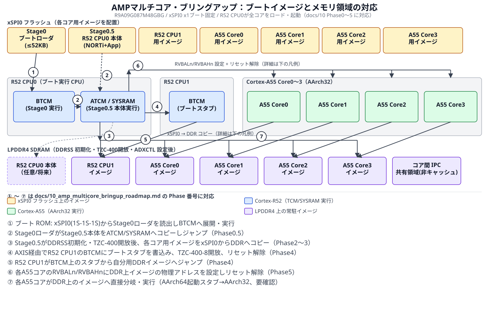
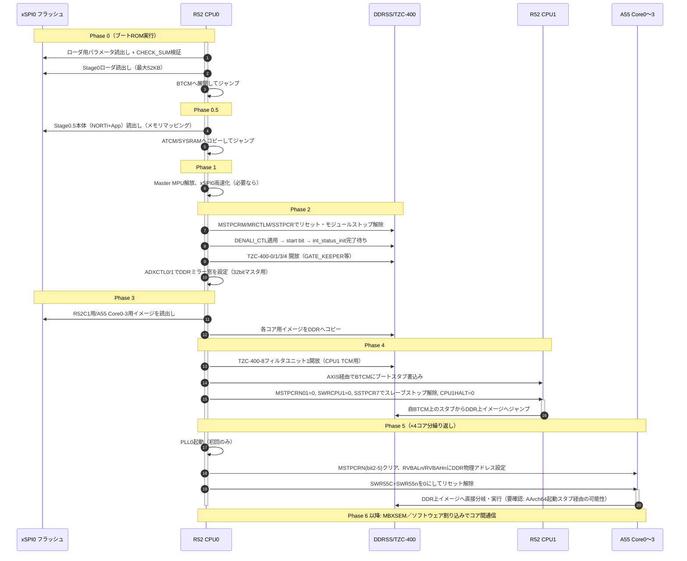

# AMP マルチコア・ブリングアップ ロードマップ（R52C0 → R52C1 + A55 Core0-3、NORTi）

[← README（目次）へ戻る](README.md)

## 前提

- 動作モード: **xSPI0 ブートモード（x1）固定**。ブート ROM は常に **Cortex-R52 CPU0** で実行。
- 全コア（R52 CPU0、R52 CPU1、A55 Core0〜3）で **NORTi** を使用し、**AMP**（各コアが独立した NORTi インスタンス／アプリを実行）構成。
- **Cortex-A55 は AArch32 実行状態で使用する**（確定仕様）。Cortex-R52 はもともと Armv8-R AArch32 専用なので、**全コアが AArch32 で統一**される。詳細・MMU設定への影響は [11_memory_performance_comparison.md](11_memory_performance_comparison.md) §5.4、[12_ddr_noncacheable_region_setup.md](12_ddr_noncacheable_region_setup.md) §2 を参照。
- R52 CPU0 が最初に起動し、ペリフェラル初期化・LPDDR4 初期化を行った後、**他の全コアをそれぞれ個別にロード・起動**する。
- LPDDR4 の初期化パラメータ・DDR PHY トレーニング値は **Renesas ツールで生成済み**（このロードマップでは「その値をどう適用し、どう起動をトリガし、どう完了を確認し、どう各バスマスタに開放するか」に焦点を当てる）。
- 本書は [09_xspi0_x1_boot_and_runtime.md](09_xspi0_x1_boot_and_runtime.md)、[03_memory_map.md](03_memory_map.md)、[05_clocks_reset.md](05_clocks_reset.md) を前提とする。

> **NORTi 自体のポーティング作業（GIC 初期化、MMU/MPU テーブル、タスクスケジューラ起動等）は本書の範囲外。** 本書は RZ/N2H 側のハードウェアシーケンス（クロック／リセット／モジュールストップ／TrustZone／アドレス拡張／マルチコア起動レジスタ）を整理したもの。

## 0. コア一覧とアドレス空間の要点

出典: 「2. Cortex-A55」p.176-179、「3. Cortex-R52」p.180-186、[03_memory_map.md](03_memory_map.md)

| コア | 起動時ベクタ | ベクタ設定方法 | AXIS/GIC ベース | クラスタ ID |
|------|-------------|---------------|-----------------|-------------|
| Cortex-R52 CPU0 | `0x0000_0000`（自 ATCM 先頭）固定 | 変更不可（ブート ROM 専用） | AXIS: `0x2000_0000` / GIC: `0x9400_0000` | Affinity1=0x0 |
| Cortex-R52 CPU1 | `0x0000_0000`（自 ATCM 先頭）固定 | **変更不可**。他コアが AXIS 経由で CPU1 の ATCM に直接コード配置 | AXIS: `0x2100_0000` / GIC: `0x9C00_0000` | Affinity1=0x0, Affinity2=0x2 |
| Cortex-A55 Core0〜3 | 任意の 40 bit アドレス（**DDR も直接指定可**）| `RVBALn`/`RVBAHn` レジスタで設定 | GIC-600: `0x8300_0000` | Affinity1=0x0/0x1 |

**重要な非対称性**: Cortex-R52 の 2 コアは「自分の ATCM 先頭」からしか起動できない（ベクタベースアドレスが固定）。Cortex-A55 の 4 コアは `RVBALn`/`RVBAHn`（40 bit、DDR 領域 `0x2_0000_0000`〜 も含む）で**起動先を自由に指定できる**。
→ **R52 CPU1 は必ず自分の ATCM に小さな「ブートスタブ」が必要**（DDR 上の本体へ飛ぶための最小コード）。**A55 の 4 コアは DDR 上のイメージ先頭を直接 `RVBALn`/`RVBAHn` に設定すれば、TCM スタブなしで直接起動できる**（NORTi の A55 起動コード自体が物理アドレス・MMU/キャッシュ off で開始することが前提、Armv8-A のコールドリセット作法どおり）。

## 0.9 全体像を図で見る（★まずここを見ると分かりやすい）

以下、本ロードマップの Phase 0〜5 を「①〜⑦」の番号で通した図解。以降の本文（Phase 0〜6）は、この図の各矢印の**手順の詳細**という位置づけ。

### 0.9.1 メモリマップ図: どのブートイメージがどの領域へロードされるか

読み方: 上段が **xSPI0 フラッシュ上に配置しておくイメージ**（7 個）。中段が **それぞれのコアが実際にコードを実行する場所**（R52 CPU0 の BTCM→ATCM/SYSRAM、R52 CPU1 の BTCM、A55 Core0〜3）。下段が **LPDDR4 上の最終的な常駐先**。矢印の①〜⑦は下の凡例および本文の Phase 番号に対応する。

- **R52 CPU0 だけが「ローダ役」**（①②③④⑥を全部実行する）。他のコア（R52 CPU1、A55 Core0〜3）は「書き込まれる／起動される側」で、自分でフラッシュを読みに行く必要はない。
- **R52 CPU1 だけ TCM 上に小さな「ブートスタブ」が要る**（ベクタが自分の BTCM に固定のため）。A55 の 4 コアは DDR のイメージ先頭を直接指すだけで TCM 上のスタブが不要、という非対称性が図から読み取れる。

### 0.9.2 シーケンス図: 時系列でどのコアが何をするか

## Phase 0: ブート ROM 〜 一段目ローダ（BTCM）

詳細は [09_xspi0_x1_boot_and_runtime.md](09_xspi0_x1_boot_and_runtime.md) を参照。要点のみ:

- ブート ROM が xSPI0 (x1, 1S-1S-1S) から**最大 52 KB** のローダプログラムを BTCM (`0x0010_2000`〜`0x0010_EFFF`) に展開し、R52 CPU0 で実行開始（`BOOTCPU_FLG = 0`）。
- 52 KB では NORTi 本体＋アプリは収まらない前提で、**この一段目ローダは「本体（二段目）を ATCM または SYSRAM にコピーして飛ぶだけ」の最小トランポリンにする**。

## Phase 0.5: 二段目（R52 CPU0 の "本体" ローダ／NORTi 早期初期化）

一段目ローダが xSPI0 のメモリマッピングモードで、R52 CPU0 用の本体イメージ（NORTi + 起動/ロードマネージャ）を **ATCM（512 KB）** または **SYSRAM（2 MB、他バスマスタと共有）** へコピーし、ジャンプする。

以降のフェーズ（クロック確認・レジスタ保護解除・Master MPU 解放・DDR 初期化・他コア起動）は、この二段目コードが R52 CPU0 上で実行する。

### 0.5.1 レジスタ書き込み保護の解除パターン（繰り返し使用）

- `PRCRN`（`0x8029_4200`）/ `PRCRS`（`0x8129_6000`）に `PRKEY=0xA5` ＋ 対象 `PRCi` ビットを 1 にして解除、操作後に `PRCi=0` へ戻す。
- 本ロードマップで解除が要る主な対象:
  - `PRCRN.PRC1` / `PRCRS.PRC1` … `MSTPCRA〜E,J〜M`（ノンセーフティ）と `MSTPCRG,I,N`（セーフティ）、`MRCTLA/E/M`、`SWRCPU0/1`、`SWR55C/550-553` など
  - `PRCRS.PRC3` … マスタ MPU 関連レジスタ（`STADDm`/`ENDADDm`/`ERRINF*`）、`RVBALn`/`RVBAHn`、`CPU1HALT`
- 詳細は [03_memory_map.md](03_memory_map.md)・マニュアル 11 章。

### 0.5.2 Master MPU の解放（★他コア起動より前に必須）

出典: 「13.5.2 マスタ MPU の初期設定」p.526

> 領域 0 の初期設定は、**すべてのマスタ MPU に対しメモリマップの全範囲を読み出し／書き込み保護**で指定。マスタモジュールがどのバススレーブもアクセスできない。**Cortex-R52 CPU0 からマスタ MPU レジスタを変更しなければならない。** Cortex-R52 CPU0 ブートモードの場合、Cortex-R52 CPU0 が `CPU_CTRL`（`0x8124_0000`）レジスタを設定することで、**Cortex-A55 と Cortex-R52 CPU1 もマスタ MPU レジスタを変更できるようになる**。

- これは DMAC / GMAC / USB / SDHI / LCDC / PCIE / CoreSight など「マスタ MPU 管理下」の DMA 能力を持つモジュールの話であり、CPU コア自体の DDR アクセス可否は TZC-400（§Phase2）が別に管理する。ただし **DMAC を使って画像コピーする計画がある場合は必須の前提**。
- `CPU_CTRL` の `CR521_CTRL`（bit0）/ `CA550_CTRL`〜`CA553_CTRL`（bit8〜11）を 1 にして、R52 CPU1 と A55 各コアが自分でマスタ MPU レジスタを触れるようにしておく（各コアの NORTi 起動コードが自分用の MPU 設定を行うなら、ここで許可しておく）。

### 0.5.3 クロック確認

- `PLL1`（R52/R-Bus/周辺、1000 MHz）は起動時から動作中の前提（R52 CPU0 自身が動いているため）。
- `PLL2`（DDRSS/SDHI、800 MHz）が **DDR 初期化（Phase 2）前に必要**。ブート時点で有効か `PLL2EN`/`PLL2MON` 等で確認し、無効なら起動する（[05_clocks_reset.md](05_clocks_reset.md)、マニュアル 7.5 PLL 回路）。
- `PLL0`（A55、1200 MHz）は **A55 コアを 1 つでも起動する前に** R52 CPU0 が起動する必要がある（2.6.1 手順の step2。詳細は Phase 5）。

## Phase 1: xSPI0 の高速化（必要なら）

一段目ローダがブート時の低速設定（既定 12.5 MHz）のまま `RESTORE_FLG ≠ 0x2236_0679` で維持していれば、[09](09_xspi0_x1_boot_and_runtime.md) §2.2 の手順（通信停止確認 → `WRAPCFG`/`COMCFG`/`CMCFG*`/`LIOCFGCS0` 再設定 → 必要なら自動キャリブレーション）で高速化してから、後段の大容量イメージ転送に備える。x1 プロトコル（1S-1S-1S）のままクロック分周のみ上げる、または対応フラッシュがあれば 4S-4D-4D 等へプロトコル変更も可能（表 4.10 の `WRAPCFG_V`/`LIOCFGCS0_V` の仕組みと同じレジスタ群）。

## Phase 2: LPDDR4 (DDRSS) 初期化

出典: 「57. LPDDR4 SDRAMサブシステム (DDRSS)」p.3659-3743、「13.5.6 DDRSSレジスタアクセス」p.528、「13.4.3 スレーブストップ機能」p.515-516、「9.3.11/9.3.12 MSTPCRM/N」p.286-287

前提: **DDR パラメータ生成ツールが出力した `DENALI_CTL_*` レジスタ設定値一式は入手済み**という想定（ユーザー確認済み）。ここではその値を安全に適用する手順を示す。

### 2.1 リセット／モジュールストップ解除（順序が重要）

DDRSS 関連レジスタ:

| レジスタ | ベース+オフセット | 内容 |
|----------|-------------------|------|
| `MSTPCRM` | `0x8028_0330` | bit0 = DDRSS モジュールストップ |
| `MRCTLM` | `0x8028_0270` | bit8=PCIE、**bit16〜25 = DDRSS の各リセット**（`rst_n`, `PwrOkIn`, `Reset`, `axi0〜4_ARESETn`, `MC_PRESETn`, `PHY_PRESETn`）。マニュアル注: 「DDRSS リセット制御のために `MRCTLM[25:16]` に**同じ値**を設定してください」 |
| `SSTPCR0` | `0x8129_1200`* | `DDRA0/A1/A4_REQ`・`_ACK`（メインバス A 側スレーブストップ）|
| `SSTPCR4` | `0x8129_0200` | `DDRR2/R3_REQ`・`_ACK`（メインバス R 側）＋ **`DDRAPB`（bit8, DDR APB I/F ストップ）** |

\* `SSTPCR0` はマニュアル記載の Base+Offset（`SSC=0x8129_0200`, offset `0x1000`）をそのまま加算した値。実装時は必ずマニュアル該当ページの Base/Offset を直接参照すること。

**手順（13.4.3 の一般手順を DDRSS に適用）:**

1. `PRCRN.PRC1` を解除（キー書き込み）。
2. `MSTPCRM.MSTPCRM00 = 0`（モジュールストップ解除）→ 直後に `MSTPCRM` を **1 回ダミーリード**。
3. `MRCTLM[25:16]` を**全ビット同時に 0** へ（DDRSS のリセット解除。PCIE と共用レジスタなので bit8(PCIE) は変更しないこと）。
4. `SSTPCR0` の `DDRA0_REQ`/`DDRA1_REQ`/`DDRA4_REQ` を `0` に設定 → 各 `_ACK` が `0` になるまでポーリング。
5. `SSTPCR4` の `DDRR2_REQ`/`DDRR3_REQ` を `0` に設定 → 各 `_ACK` が `0` になるまでポーリング。
6. `PRCRN.PRC1` を再ロック。

**ハングアップ回避（13.5.6、★見落としやすい）:**
> `SSTPCR4.DDRAPB` が `0` に設定され、かつ DDRSS がリセット状態（`MRCTLM24=1` または `MRCTLM25=1`）のとき、DDRSS レジスタアクセスで**ハングアップ**が発生する。DDRSS がリセット状態の間は `DDRAPB=1` にしておく必要がある（読み出し値は常に 0）。**`MRCTLM24=0` かつ `MRCTLM25=0` になった後**、`DDRAPB=0` にして初めて実際のレジスタアクセスが許可される。

`DDRAPB` はリセット値が `1` なので、上記手順 3（`MRCTLM[25:16]=0`）が完了するまで **`DDRAPB` を `0` に書き換えないこと**。手順 3 の直後に:

7. `SSTPCR4.DDRAPB = 0`（DDRSS レジスタアクセス許可）。

### 2.2 DENALI_CTL レジスタの適用と起動トリガ

- DDRSS レジスタベース: `0x8030_0000`〜（`DDR_MEMC_DENALI_CTL_00` など。詳細アドレスはマニュアル表 57.3、[03_memory_map.md](03_memory_map.md)）。書き込み保護なし。
- Renesas ツールが生成した `DENALI_CTL_*` の値を**すべて**書き込む（`DENALI_CTL_00.start` はまだ `0` のまま最後に回す）。
- `DENALI_CTL_00.start`（bit0）に **`1`** を書き込み、コントローラのアクティブモード（初期化＋通常動作）を開始（マニュアル 57.3.1）。
  - 注: `start=1` を書く前に、コントローラが `dfi_reset_n_pZ`／`dfi_cke_pZ` を駆動している必要がある、とマニュアルに明記あり — これも DDR パラメータツールが生成する初期レジスタ設定の一部で満たされる想定。

### 2.3 初期化完了の確認

`int_status_init`（表 57.25）・`int_status_dfi`（表 57.26）をポーリングまたは `DDRC_INT` 割り込みで監視:

| ステータスビット | 意味 |
|------------------|------|
| `int_status_init` bit1 | **MC（メモリコントローラ）の初期化が完了** ← まずこれを待つ |
| `int_status_init` bit0 | メモリリセットが DFI バス上で有効 |
| `int_status_dfi` bit3 | 初期化後に `dfi_init_complete` 信号の状態変化を検出 |
| `int_status_training` bit11 | ZQ キャリブレーション動作完了（詳細は `zq_status_log`）|

`int_status_init` bit1 が立つまでは、コントローラのコアコマンドキューはコマンドを受け付けない（57.3.1 の注）。各グループのステータスは対応する `int_ack_<group>` に書いてクリアする。

### 2.4 TZC-400 を開放（★これをやらないと CPU/DMA から DDR に一切アクセスできない）

出典: 「13.4.4.3 TZC-400」p.521-522

> リセットの解除後、**TZC-400 は全トランザクションを拒否して起動**する。セキュアトランザクションによって適切なアクセス許可に TZC-400 のコントロールレジスタを設定して、適切なアクセス属性でマスタがメモリ領域にアクセスできるようにする。

DDR に関係する TZC-400 インスタンス（表 13.12）:

| シンボル | 対象 I/F | ベースアドレス | 使う場面 |
|----------|---------|----------------|----------|
| TZC-400-0 | DDR A0/A1 I/F | `0x8110_0000` | Cortex-A55、GMAC1/2、USB、SDHI、LCDC などメインバス A 経由 |
| TZC-400-1 | DDR A4 I/F | `0x8110_1000` | メインバス A 側の別ポート |
| TZC-400-3 | DDR R2 I/F | `0x8110_3000` | **Cortex-R52 CPU0/CPU1**、DMAC などメインバス R 経由 |
| TZC-400-4 | DDR R3 I/F | `0x8110_4000` | メインバス R 側の別ポート |

- 開放の考え方はブート ROM 自身が **TZC-400-5（SYSRAM）／TZC-400-7（xSPI）に対して行っている設定**と同型（表 4.10 実測値）: `GATE_KEEPER = 0x000F000F`、`SPECULATION_CTRL = 0x00000003`、`REGION_ATTRIBUTES_0 = 0xC000000F`、`REGION_ID_ACCESS_0 = 0x000F000F`。これを **TZC-400-0/1/3/4 に同じパターンで適用**すれば、リセット後デフォルトの「領域 0 = フル範囲」に対して全トランザクション許可になる（表 13.11 のフィルタリングルールで `nsaid_wr_en/rd_en = 0x000F` は「非セキュア特権なしを含む全トランザクション許可」に相当）。
- **注意（要検証）**: 本マニュアルは TZC-400-0/1/3/4 に対する数値実例を掲載していない（ブート ROM が触るのは 5/7 のみ）。上記はブート ROM の実証済みパターンからの類推であり、**Arm CoreLink TZC-400 Technical Reference Manual のレジスタオフセット定義と突き合わせて確認**すること（本マニュアルはレジスタオフセットの詳細を記載していない）。
- Cortex-R52 の AXIS インタフェース経由で TCM をアクセスする場合の TZC-400-8（filter0=CPU0, filter1=CPU1, `0x8110_8000`）も同型で扱う（Phase 4 で使用）。

### 2.5 R52 用アドレス拡張（32 bit マスタから DDR を見るためのミラー設定）

出典: 「13.4.5 アドレス拡張」p.522-523

Cortex-R52（CPU0/CPU1 とも 32 bit マスタ）は DDR 領域（`0x2_0000_0000`〜`0x3_FFFF_FFFF`, 8 GB）に直接アクセスできない。`ADXCTLn` レジスタで **512 MB 単位のミラー窓を 2 つ**、32 bit 空間の `0xC000_0000`〜`0xDFFF_FFFF`（ミラー0）／`0xE000_0000`〜`0xFFFF_FFFF`（ミラー1）に設定する。

| マスタ | レジスタ | ベース |
|--------|---------|--------|
| Cortex-R52 CPU0 | `ADXCTL0` | `0x8129_0100` |
| Cortex-R52 CPU1 | `ADXCTL1` | `0x8129_0104`（`ADXCTL0`+`0x04`）|

- `ADXCTL0.DDRMIR0[4:0]` / `DDRMIR1[4:0]` に、DDR 領域内でマップしたい 512 MB 境界の先頭アドレス `[32:28]` を設定（`0x1F` は禁止）。
- 各コアが個別に設定できるので、**R52 CPU0 用と CPU1 用で異なる 1 GB（512 MB×2）を割り当てる**か、同じ範囲を共有するかは設計次第。AMP で各コアの作業領域を明確に分離するなら別窓を推奨。
- Cortex-A55 と CoreSight (AXI-AP) は 64 bit マスタなので `0x2_0000_0000`〜 に直接アクセスでき、この設定は不要（32 bit 側ミラーも固定アドレスで別途利用可、13.4.5 注1-3）。

## Phase 3: 各コア用イメージを xSPI0 → DDR / SYSRAM / TCM へロード

R52 CPU0（二段目コード）が、[09](09_xspi0_x1_boot_and_runtime.md) のメモリマッピングモードで xSPI0 (`0x4000_0000`〜) から読み出し、各コアの実行先メモリへコピーする。

> **全コアを DDR で動かす必要はない。** 速度・タイミングの決定性が必要な処理は、R52 なら自分の **ATCM/BTCM**、A55 なら（TCM がないため次善として）**SYSRAM** に residents させ、それ以外の大容量・低優先度の部分だけ DDR に置く、という**混在構成が可能かつ推奨**。速度差の詳細と根拠は [11_memory_performance_comparison.md](11_memory_performance_comparison.md) を参照。特に **R52 + 自 TCM がチップ内で最速・最も決定的**であり、「A55 + SYSRAM」がそれを上回ることはない（SYSRAM は 250 MHz 固定・全マスタ共有・調停ありのため）。

### 3.1 DDR パーティション例（8 GB のうち先頭数百 MB を例示）

以下は「DDR に置く部分」の例。R52 の低遅延処理は ATCM/BTCM に、A55 の低遅延処理は SYSRAM（`0x1000_0000`〜`0x101F_FFFF`、4 ユニット×512 KB）に別途配置し、DDR にはそれぞれの「本体の大部分・低優先度データ」を置く想定。

| 用途 | 例アドレス（64 bit / A55 視点）| サイズ目安 | 備考 |
|------|-------------------------------|-----------|------|
| R52 CPU0 本体（NORTi+App）| `0x2_0000_0000`〜 | 数 MB | Phase 0.5 で ATCM/SYSRAM 実行中の場合、余裕が出た時点で DDR に引っ越すことも可能（必須ではない）|
| R52 CPU1 用イメージ | `0x2_0010_0000`〜 | 数 MB | R52 CPU1 の `ADXCTL1` ミラー窓でアクセス |
| A55 Core0 用イメージ | `0x2_0100_0000`〜 | 数 MB〜数十 MB | `RVBAL0`/`RVBAH0` に直接この物理アドレスを設定 |
| A55 Core1 用イメージ | `0x2_0200_0000`〜 | 同上 | `RVBAL1`/`RVBAH1` |
| A55 Core2 用イメージ | `0x2_0300_0000`〜 | 同上 | `RVBAL2`/`RVBAH2` |
| A55 Core3 用イメージ | `0x2_0400_0000`〜 | 同上 | `RVBAL3`/`RVBAH3` |
| コア間 IPC 共有領域 | 任意 | 用途次第 | §5 参照。非キャッシュ属性 or 明示的キャッシュ操作が必要 |

（アドレス・サイズは設計次第。実際のイメージサイズ・NORTi のメモリマップ設計に合わせて再割当てすること。）

### 3.2 コピー後のキャッシュ整合性（★見落としやすい）

- R52 CPU0 の D キャッシュを有効にしてコピーした場合、コピー先が **他コアの命令フェッチ対象**になる前に、**該当範囲を D キャッシュからクリーン（write-back）** する必要がある（Armv8-A/R のキャッシュ規則。RZ/N2H 固有のハードウェアコヒーレンシ機構はコア間に存在しない）。
- 消費コア側（A55 各コア、R52 CPU1）は起動直後に自分の I キャッシュを無効化／該当範囲を invalidate してから実行するのが安全（通常は各コアのリセット直後は I/D キャッシュ無効なので、有効化前にロードが完了していれば問題にならないことが多いが、明示的なバリア/クリーンは徹底すること）。

## Phase 4: Cortex-R52 CPU1 の起動（3.6.2 の手順そのまま）

出典: 「3.6.2 Cortex-R52 CPU1 の起動方法」p.185

R52 CPU1 の起動ベクタは自分の ATCM 先頭に固定のため、**まず ATCM に小さなブートスタブを書き込み**、そのスタブが DDR 上の本体（Phase 3 でロード済み）へジャンプする、という 2 段構成にする。

**手順（マニュアル記載の 7 ステップをそのまま踏襲）:**

1. `TZC-400-8` の **フィルタユニット1**（CPU1 の TCM）は後述ステップ5で設定するが、この時点ではまだ CPU1 の ATCM への AXIS アクセスは許可されていない前提でよい（下記ステップ5で開放）。まず AXIS インタフェース (`0x2100_0000`) 経由で **CPU1 の ATCM をデバイス属性に設定**（R52 CPU0 側の MMU/MPU 属性設定）。
2. `MSTPCRN.MSTPCRN01 = 0`（CPU1 のモジュールストップ解除）。
3. `SWRCPU1 = 0x00000000`（CPU1 のリセット状態を解除）。
4. `SSTPCR7` の `AXIS1_REQ`/`AXIS1_ACK` を制御してスレーブストップ状態から解除（`SSTPCR7` ベース `0x8129_0200`+`0x000C`、`AXIS1_REQ`=bit4, `AXIS1_ACK`=bit5）。
5. **TZC-400-8 のフィルタユニット1を設定**（CPU1 の TCM に AXIS 経由でアクセスできるようにする。§Phase2.4 と同型の GATE_KEEPER/REGION 設定）。
6. **STRD 命令による 64 bit アライメントの 64 bit アクセス**で、AXIS インタフェース (`0x2100_0000`) 経由で CPU1 の ATCM 先頭にブートスタブのコードを格納。ECC が既定で有効なため、残りの ATCM 領域も同様のアクセス方法で初期化することを推奨（未初期化 ECC 領域への通常アクセスは ECC エラーになり得るため）。
7. `CPU1HALT` レジスタ（`TCMAW = 0x8129_5008`, offset `0x08`）の `CPU1HALT` ビットに **`0`** を書き込み、命令フェッチを開始。

**ブートスタブの内容（推奨最小限）:**
- 例外ベクタテーブル（`0x0000_0000` 起点、CPU1 の ATCM 先頭）
- 最小限のスタック設定
- 自分用の 2 段 MPU（EL2/EL1）に、DDR 上の本体イメージ領域へのアクセスを許可するリージョンを設定
- 本体イメージの物理アドレス（Phase 3 で決めたロード先）へ分岐

## Phase 5: Cortex-A55 Core0〜Core3 の起動（2.6.1 の手順そのまま、×4 回）

出典: 「2.6.1 Cortex-A55 の起動方法」p.179

> Cortex-R52 ブートモードの場合、RES 端子リセット等の後、Cortex-A55 の Core0〜Core3 および Cortex-A55 用 WDT は**リセット状態およびモジュールストップ状態を維持**する。他の CPU により以下のシーケンスで起動する。

> **★ A55 を AArch32 で使用する場合の補足（要確認事項）**: `RVBALn`/`RVBAHn` は Arm アーキテクチャ上の `RVBAR_EL3`（EL3 が最高実装 Exception Level の場合、**AArch64 状態で実行するときの**リセット後の実行開始アドレス）に相当する（`arm/cortex_a55_trm_r2p0.pdf` §B2.93）。TRM は「RVBAR_EL3 contains the ... address that execution starts from after reset **when executing in AArch64 state**」と明記しており、**コア冷起動時の最高実装 EL は基本的に AArch64 で立ち上がる**のが一般的な Armv8-A SoC の実装パターン。つまり `RVBALn`/`RVBAHn` に置くコードは、
> 1. ごく短い **AArch64 の起動スタブ**（`SCR_EL3`/`HCR_EL2` 等で下位 EL を AArch32 に設定し `ERET` で降格する）を経てから、本体（NORTi + アプリ、AArch32）に分岐する、
>
> という 2 段構成になる可能性が高い。RZ/N2H マニュアルはこの点について記載がなく（AArch32/AArch64 の区別自体に言及していない）、**Renesas または NORTi の A55 BSP に、コールドリセット時の実行状態（AArch64 で立ち上がるか、直接 AArch32 で立ち上がるように配線されているか）を確認する必要がある**。NORTi が AArch32 専用ポートとして提供されている場合、このスタブは NORTi の起動コードに含まれているはずなので、実装上は NORTi 側の指示に従えばよい。

**手順（マニュアル記載の 5 ステップ、コアごとに繰り返し）:**

1. **指定先のリセットベクタアドレスに命令コードを格納**（＝Phase 3 で DDR 上に配置済みの各コア用イメージがこれに相当。R52 CPU0 が事前に書き込んでおく）。
2. **PLL0 を起動**（A55 用、1200 MHz。詳細はマニュアル「7.5 PLL 回路」）。**最初の 1 コアを起動する前に 1 回だけ**でよい（2 コア目以降は不要、下記注参照）。
3. `MSTPCRN` レジスタの対応ビット（**bit2〜bit5 = Core0〜Core3**）をクリアして、対象 Core をモジュールストップ状態から解除。DSU は常にモジュールストップ状態ではない。
4. `RVBALn`/`RVBAHn`（`CA55 = 0x8129_5000`, `RVBALn` offset `0x20+0x08×n`, `RVBAHn` offset `0x24+0x08×n`）に、Step1 で配置したコードの物理アドレス（**40 bit、DDR 上のアドレスを直接指定可能**）を設定。
5. **`0x00000000` を `SWR55C` と対応する `SWR55n`（`n`=0〜3）レジスタに設定**し、DSU と Core n をリセット状態から解除。

> 「Cortex-A55 の Core1〜Core3 はリセット状態およびモジュールストップ状態を維持する。起動シーケンスは上記と同じだが、**PLL0 と DSU を繰り返し動作する必要はない**」（＝Step2 の PLL0 起動、および `SWR55C` の設定は初回のみでよく、2 コア目以降は Step3/4/5 のうち `SWR55C` は既に解除済みなので実質 `SWR55n` のみ操作すればよい、という意味に読める。ただし `SWR55C`/`SWR55n` は同時に同じレジスタへ書く仕様なので、実装上は「`SWR55C` ビットは既に 0、対象 `SWR55n` ビットだけ 0 にする」書き方になる）。
6. 本 LSI では **P チャネルと Q チャネルは使用されない**（Arm仕様上のオプション機能、無視してよい）。

## Phase 6: 全コア起動後の確認・補足

### 6.1 コア間通信 (IPC)

- **MBXSEM（メールボックス＋セマフォ）**: 外部ホスト CPU および Cortex-A55/Cortex-R52 用の **8 セマフォ**、双方向 **32 bit メールボックス×4**。**Cortex-A55、Cortex-R52 の CPU0/CPU1 間で排他アクセスをするセマフォ／メールボックス**として使える（1 章特長より）。AMP 構成でのコア間同期・簡易メッセージパッシングに最適。詳細はマニュアル「47. メールボックスおよびセマフォ (MBXSEM)」。
- **ソフトウェア割り込み（12 章 ICU、★詳細読解済み）**: 特定コアを起こす用途に**使える**。仕組みと制約は以下のとおり。

  **トリガ方法**: `NS_SWINT`（`ICU_NS = 0x802A_0000`, offset `0x00`）の `IC0`〜`IC13` ビット、または `S_SWINT`（`ICU_S = 0x812A_0000`）の `IC14`/`IC15` ビットに `1` を書き込むと、対応する `INTCPUn`（n=0〜15）がエッジ割り込みとして発生する（書き込み専用レジスタ、読むと常に 0）。

  **★ルーティングの実態（表12.17 イベントテーブルで確認）**: `INTCPU0`〜`INTCPU15` は**個別に単一のCPUだけを狙って発火する仕組みではなく、16 要因すべてが Cortex-A55 GIC-600 SPI・Cortex-R52 CPU0 GIC・Cortex-R52 CPU1 GIC の**3 つの割り込みコントローラへ**同時に配線（broadcast）**されている（`INTCPU0`〜`13` はさらに DMAC 起動要求・ELC 要因にも接続。`INTCPU14`/`15`（セーフティ）は GIC 3 系統のみで DMAC/ELC 非接続）。つまり `NS_SWINT.IC5=1` と書くと、A55 の GIC-600・R52 CPU0 の GIC・R52 CPU1 の GIC の**全部**に SPI 番号 5 の割り込みが同時に立つ。

  **特定の1コアだけに届けるための実装方法**: ICU 側では絞り込めないので、**受信側の各 GIC で該当 SPI 番号を有効化するかどうかを個別に設定**する（Arm GIC アーキテクチャの標準機能、ICU 固有ではない）。具体的には:
  1. 「`INTCPUn` は用途 X（例: 特定コアへの起床通知）専用」という**割り当てをソフトウェア的な取り決めとして決める**（例: `INTCPU0`=R52 CPU1 起床用、`INTCPU1`〜`4`=A55 Core0〜3 起床用、等）。
  2. **届けたいコアの GIC でだけ、その SPI 番号を有効化（unmask）**する。届けたくないコアの GIC ではその番号を無効のままにしておく（各コアが自分の初期化コードで自分の GIC だけを設定すればよく、他コアの GIC 設定に触れる必要はない）。
  3. Cortex-A55 は 4 コアで GIC-600 を共有するため、**A55 Core0〜3 のうち特定の 1 コアだけに届けたい場合**は、GIC-600（GICv3 系）の **SPI ルーティングレジスタ（`IROUTER`、Arm GIC-600 TRM 参照）**で当該 SPI の配送先コアを指定する（これは Arm 標準 GIC アーキテクチャの機能であり、RZ/N2H 固有ではない）。
  4. 送信側は `NS_SWINT`/`S_SWINT` に対応ビットを立てるだけでよい（複数ビットを同時に立てれば複数チャネルを一度に発火可能）。受信側は自分の GIC に割り込みが立って初めて ISR が起動する。
  - 参考: 上記の MBXSEM と同様の「データ＋ドアベル」構成にする場合、**ドアベル役をこのソフトウェア割り込みに、データ本体を DDR の共有領域に**、という組み合わせも可能（MBXSEM の代替、またはより多チャンネルが欲しい場合の選択肢）。
- **排他アクセス命令の制限（13.5.5）**: `LDREX`/`STREX` 系は **システム SRAM では禁止**。代替は (a) MBXSEM を使う、(b) **LPDDR4 SDRAM への排他的アクセスを使う**、(c) システム SRAM をキャッシャブル・非共有設定にして CPU の MPU/MMU 経由でのみ排他アクセスする、のいずれか。AMP 間で DDR 上の共有構造体に排他アクセスしたい場合は (b) が素直。
  - 注: RZ/N2H マニュアル 13.5.5 は A55 の排他命令として `LDXRB`/`LDAXR`/`STXR` 等の **AArch64 の命令名**を挙げているが、これは執筆時に A55=AArch64 を想定した記載と考えられる。**A55 を AArch32 で使う場合、実際に使う命令は R52 と同じ `LDREX`/`STREX`／`LDREXD`/`STREXD` 系**（A32/T32 の排他アクセス命令。Armv8-R と Armv8-A の AArch32 状態は同一の命令セットを共有するため）。動作原理・制約（SYSRAM禁止、代替手段）自体は変わらない。

### 6.2 キャッシュ・コヒーレンシ

- Cortex-A55 クラスタ内（Core0〜3）は ACE 経由で **L3 キャッシュ共有・コヒーレント**。
- しかし **Cortex-A55 クラスタ ⇔ Cortex-R52 CPU0/CPU1 ⇔ DMAC 等、他バスマスタとの間にはハードウェアコヒーレンシがない**。DDR 上の共有領域（IPC バッファ等）は非キャッシュ属性にするか、書き込み側でクリーン・読み出し側でインバリデートを徹底すること。

**「DDR をキャッシュ経由で使うこと」自体は危険ではない点に注意。** 危険なのは「複数コアが読み書きする共有領域を、何のケアもなくキャッシュしたまま使う」場合のみ。

| 用途 | キャッシュしてよいか | 理由・対策 |
|------|----------------------|-----------|
| R52 CPU0 専用のプライベートなコード／データ（自スタック・ヒープ・本体イメージ）| **問題なし。むしろ推奨** | 誰も横から触らないためコヒーレンシ問題が原理的に発生しない。DDR は非キャッシュだと実用速度が出ない（[11]参照）ので、プライベート領域はキャッシュを使うべき |
| R52 CPU1 専用の領域 | 同上 | 同上 |
| CPU0/CPU1（または A55）が両方読み書きする **共有 IPC 領域** | **要対策**（下記のいずれか）| CPU0 の書き込みが自分のキャッシュに留まり、CPU1 が古い内容を読む／その逆が起こり得る（ハードウェアコヒーレンシが無いため自動解決しない）|

共有領域の安全な扱い方（優先度順）:
1. **共有領域だけを非キャッシュ属性にする**（MPU で該当領域を Normal Non-cacheable 等に設定）。実装が単純で確実。小さなフラグ／メールボックス程度ならこれで十分。**具体的な設定方法（R52 の MPU／A55 の MMU）は [12_ddr_noncacheable_region_setup.md](12_ddr_noncacheable_region_setup.md) を参照。**
2. **キャッシュ属性のまま使い、明示的にキャッシュメンテナンスを行う**（書き込み側: 該当範囲をクリーン(write-back)／読み出し側: 読む前に該当範囲をインバリデート）。大きな共有バッファでキャッシュの恩恵を残したい場合の選択肢だが、同期ポイントとの紐付けを誤るとバグの温床になるため注意。
3. **MBXSEM を使う**（本チップで推奨される経路）。MBXSEM のレジスタは周辺レジスタであり**そもそもキャッシュされない**ため、キャッシュ問題が構造的に発生しない。小さなメッセージ（32bit×4メールボックス）はこれで完結し、大きなデータは「データ本体は非キャッシュ共有領域に置き、MBXSEM は準備完了の合図（ドアベル）だけに使う」という組み合わせが定石。
4. 排他アクセス命令でロックを取る場合（§6.1(b)）も、対象領域のキャッシュ属性（Non-cacheable、または適切な Shareable 設定）を正しく設定しておくこと。

### 6.3 未解決・要検証事項（このロードマップの限界）

- **TZC-400-0/1/3/4（DDR 用）の正確なレジスタオフセット**は本マニュアルに実例がない（ブート ROM が触るのは SYSRAM/xSPI 用の TZC-400-5/7 のみ）。Arm CoreLink TZC-400 TRM で正式なレジスタマップを確認し、値を検証すること。
- **GIC-600（A55）／各コア GIC（R52）の初期化**はマニュアルにベースアドレスの記載のみで、初期化手順は Arm GIC アーキテクチャ仕様および NORTi の BSP に依存する。
- **NORTi の Cortex-A55/Cortex-R52 ポートが物理アドレス直接起動（MMU/キャッシュ off）を前提にしているか**は NORTi 側のドキュメント・ベンダに確認が必要（本ロードマップは Arm 標準のコールドリセット挙動を前提にしている）。
- ~~ソフトウェア割り込みでの特定コア起床方法~~ → **解決済み**。ICU 12 章（表12.17 イベントテーブル、12.4.1）を読解し §6.1 に反映（`INTCPU0`〜`15` は 3 つの GIC 全部に broadcast、個別コアへの絞り込みは受信側 GIC の enable/mask で行う）。

### 6.4 実装言語（C だけで書けるか、アセンブラが要るか）

R52 CPU0 が Phase 1〜6 で行う「他コアを起こす」処理自体は、**ほぼ全てが C で記述可能**。理由は、対象がすべて **メモリマップドレジスタへの読み書き**（`volatile` ポインタで表現できる）だからで、CPU 自身の特殊命令（CP15 コプロセッサアクセス等）を必要としない。

| 処理 | 実体 | C で書けるか |
|------|------|------------|
| Master MPU 解放（`CPU_CTRL`） | メモリマップドレジスタ書き込み | ✅ 完全に C |
| DDRSS 初期化（`MSTPCRM`/`MRCTLM`/`DENALI_CTL_*`/`SSTPCR`） | 同上 | ✅ 完全に C |
| TZC-400 開放（`GATE_KEEPER` 等） | 同上 | ✅ 完全に C |
| `ADXCTLn` 設定 | 同上 | ✅ 完全に C |
| xSPI0 → DDR/SYSRAM/TCM へのイメージコピー（Phase 3） | メモリマップド領域間の `memcpy` 相当 | ✅ 完全に C |
| R52 CPU1 起動（`MSTPCRN`/`SWRCPU1`/`SSTPCR7`/`CPU1HALT`） | メモリマップドレジスタ書き込み | ✅ 完全に C |
| A55 起動（`MSTPCRN`/`RVBALn`/`RVBAHn`/`SWR55C`/`SWR55n`） | 同上 | ✅ 完全に C |
| ソフトウェア割り込み（`NS_SWINT`/`S_SWINT`） | 同上 | ✅ 完全に C |

**唯一の注意点（Phase 4 ステップ6）**: CPU1 の ATCM へブートスタブを書き込む際、マニュアルは「**`STRD` 命令による 64 bit アライメントの 64 bit アクセス**」を明示的に要求している（§Phase 4）。`volatile uint64_t*` への書き込みとして C で書けるが、コンパイラが実際に単一の `STRD`（64 bit 一括ストア）を生成する保証はツールチェイン依存。ECC 付き TCM のため、32 bit×2 回に分割されると未初期化 ECC 領域に対する意図しないアクセスになり得る。生成アセンブリを確認するか、確実性を優先するならインラインアセンブラ／コンパイラ組込み関数で 1 命令に固定するのが安全。

**C では書けない（＝アセンブラ相当が要る）のは「他コアを起こす処理」ではなく、R52 CPU0 自身のセットアップに混ざる CP15 コプロセッサ操作**（MPU 設定 `MRC`/`MCR p15,...`、キャッシュ有効化、バリア命令 `DSB`/`ISB`/`DMB`、排他アクセス `LDREX`/`STREX`。[12_ddr_noncacheable_region_setup.md](12_ddr_noncacheable_region_setup.md) 参照）。これらは純粋な ISO C では表現不可能な特殊命令だが:

- 各社コンパイラ（Arm Compiler、GCC、IAR）や Arm 配布の **CMSIS-Core(-A/-R)** パッケージが、C から呼べる**組込み関数（intrinsics）**として提供するのが通例。
- 実装上は「.s ファイルを新規に書く」のではなく、「C ソース中でこれらの組込み関数を数行呼ぶ」形になることがほとんど。

加えて、リセット直後の**例外ベクタテーブル**（固定オフセットに並ぶ分岐命令）と**C ランタイムが動く前のスタックポインタ初期化**は伝統的に数行のアセンブラで書くが、これは通常 **NORTi のベンダ BSP／起動コードに既に含まれるボイラープレート**であり、本ロードマップのために新規に書く部分ではない（R52 CPU1 用のブートスタブ（§Phase 4）は例外で、これは新規に用意する小さなコードなので、その中の例外ベクタ・最小スタック設定・自分用 MPU 設定は同様にアセンブラ／intrinsics 併用の小コードになる）。

### 6.5 CPU0 は起動処理後にアプリ本体（NORTi タスク）へ移行してよいか

**問題なし。むしろ本ロードマップが最初から想定している構成。** Phase 0.5（[10_amp_multicore_bringup_roadmap.md:105](10_amp_multicore_bringup_roadmap.md#L105)）の時点で、CPU0 の「二段目」イメージ自体がすでに「**NORTi ＋ 起動/ロードマネージャ**」と定義されている。つまり Phase 1〜6 の他コア起動処理は、使い捨てのブートローダではなく、**CPU0 自身の常駐アプリ（NORTi 上のイメージ）の一部**として実行される前提。

Phase 1〜6 で行うレジスタ操作（Master MPU、DDRSS、TZC-400、`RVBALn`/`SWR55n` 等）はすべて「他コア・他バスマスタ向け」の設定であり、CPU0 自身の実行状態（MPU／キャッシュ／スタック）には影響を残さない。したがって完了後に C の `main()` へ戻り、そのまま通常のアプリ/タスク処理へ継続することに技術的な障害はない。

**実装パターン（いずれも可）:**

1. **RTOS カーネル起動前にベアメタルでやる（シンプルで推奨）**: `main()` 内で Phase 1〜6（bare-metal、割り込み無効/最小限）→ 初期タスク生成 → `nrt_start()` 相当でカーネル起動（以降戻らない）、という順序。DDR 初期化完了待ち等のポーリングをビジーウェイトで素直に書ける。
2. **RTOS 起動後、最優先タスクとしてやる**: CPU0 の最初の（最高優先度）タスクとして他コア起動処理を実行し、完了後にそのタスクを終了する、または優先度を下げてアプリの通常タスク群に合流させる。RTOS の遅延 API をポーリング待ちに使える一方、スケジューラ稼働下でのレジスタシーケンスになるため割り込みマスクの扱いに注意。

どちらのパターンでも、CPU0 が「ローダ役」と「アプリ処理」を兼任することに問題はない。

## 参照

- [09_xspi0_x1_boot_and_runtime.md](09_xspi0_x1_boot_and_runtime.md)
- [03_memory_map.md](03_memory_map.md) / [04_boot_modes.md](04_boot_modes.md) / [05_clocks_reset.md](05_clocks_reset.md)
- マニュアル: 2章(p.176-179) Cortex-A55、3章(p.180-186) Cortex-R52、9章(p.271-291) 低消費電力/MSTPCR、
  13章(p.488-528) 内部バス/TrustZone/アドレス拡張、57章(p.3659-3743) DDRSS

---

[← README（目次）へ戻る](README.md)
