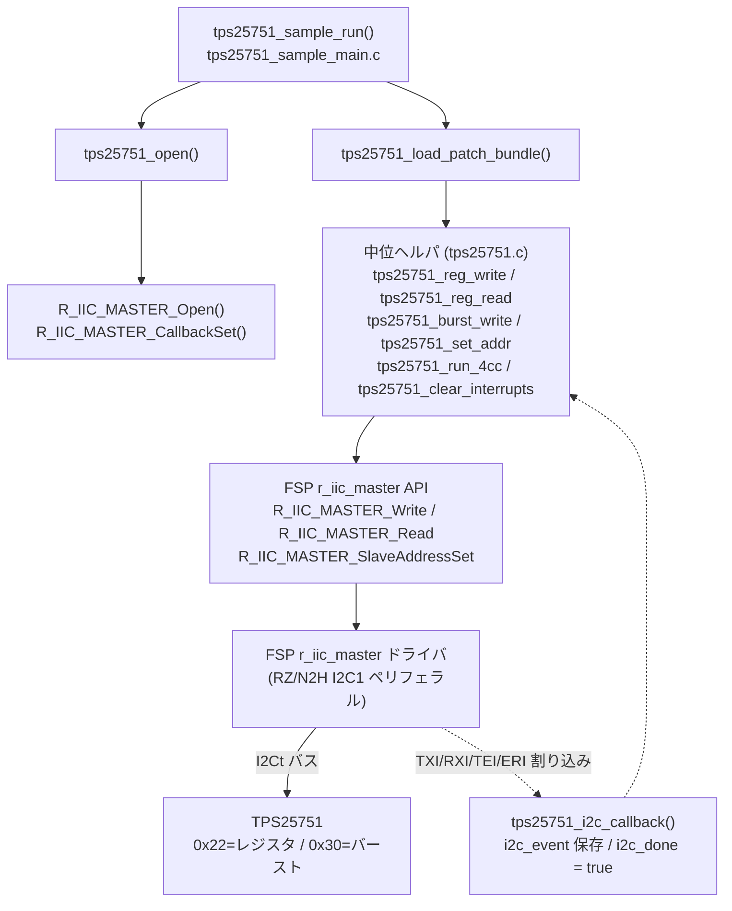
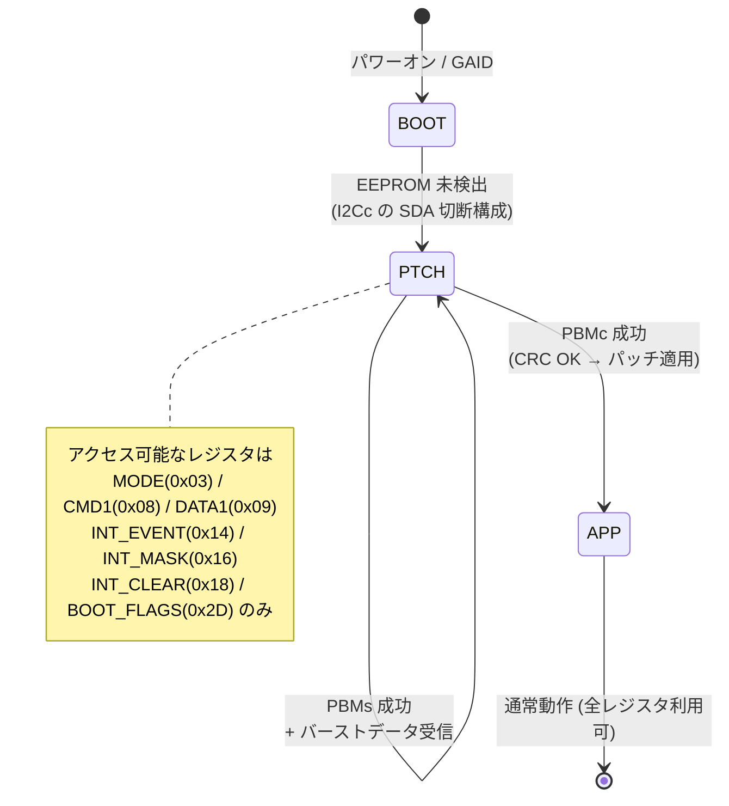
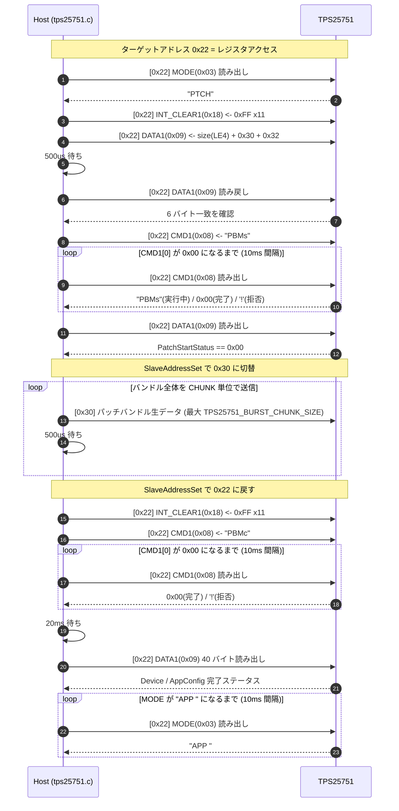
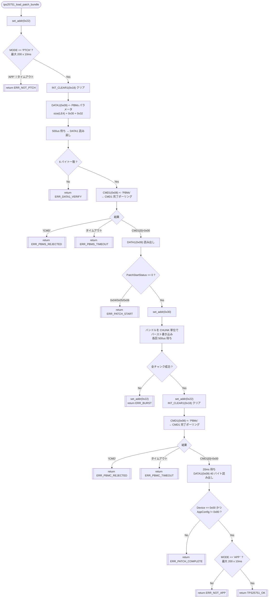
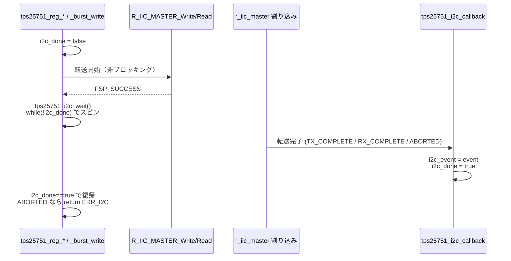

# TPS25751 パッチバンドル・ロード — 処理フロー図解

[README.md](README.md) の補足資料。`codes/` のサンプルコードが、どの層で何を呼び、
どんな I2C トランザクションを発行して `PTCH` → `APP` へ遷移させるかを図で示す。

対応コード:
[tps25751.c](tps25751.c) / [tps25751.h](tps25751.h) / [tps25751_sample_main.c](tps25751_sample_main.c)

根拠資料: TPS25751 TRM (SLVUCR8B) §1.3 / §4.5 / §5.2、Application Note JAJA940A (SLVAFV8) §4.1。

---

## 1. レイヤ構成と役割



- **サンプル層** … 呼び出し例。結果を `g_tps25751_last_*` に保持。
- **ドライバ層 (`tps25751.c`)** … TPS25751 の手順・レジスタプロトコルを実装。
- **FSP `r_iic_master`** … `R_IIC_MASTER_*` を直接呼び出し（汎用 `p_api` 経由ではない）。
- 転送は**非ブロッキング**。完了はコールバックが `i2c_done` を立て、`tps25751_i2c_wait()` がポーリングで拾う（ベアメタル）。

---

## 2. TPS25751 のモード遷移



本サンプルは「コールドブート後 `PTCH` で待機している」状態から開始する前提。

**`APP` に入る前は PD ポリシーエンジンが実質停止**しており、PDO 設定が無いため
**ソース（給電側）としては動作しない**（USB-C を挿しても VBUS へ給電しない）。
`PTCH` で生きているのは ADCIN2 ストラップで決まるデッドバッテリ／シンク経路のみ。
EEPROM（I2Cc, 0x50）非搭載の設計では、電源投入のたびにこのロードが必須。
詳細は [README.md](README.md) 「なぜこのロードが必要か（EEPROM 非搭載時）」。

---

## 3. 全体シーケンス（`tps25751_load_patch_bundle()`）



---

## 4. フローチャート（分岐とエラー終了）



結果コードの詳細は [tps25751.h](tps25751.h) の `tps25751_result_t` を参照。

---

## 5. 低レベル I2C ヘルパのバイト構成

SLVUCR8B Figure 1-2 / 1-3 のプロトコルを `R_IIC_MASTER_Write` / `R_IIC_MASTER_Read`
の `restart` 引数で組み立てている。

```
tps25751_reg_write(reg, data[len])
  R_IIC_MASTER_Write(buf, len+2, restart = false)   // 末尾 STOP
  ┌── S ─┬ 0x22+W ┬ reg ┬ len ┬ data[0] ┬ … ┬ data[len-1] ┬ P ──┐

tps25751_reg_read(reg, out[len])
  R_IIC_MASTER_Write([reg], 1, restart = true)       // STOP を出さない
  R_IIC_MASTER_Read (buf, len+1, restart = false)    // 末尾 STOP
  ┌ S ┬ 0x22+W ┬ reg ┬ Sr ┬ 0x22+R ┬ cnt ┬ d[0] ┬ … ┬ d[len-1] ┬ P ┐
      out[0..len-1] = buf[1..len]      // buf[0] = デバイスが返すバイト数

tps25751_burst_write(data[len])       // 事前に set_addr(0x30) 済み
  R_IIC_MASTER_Write(data, len, restart = false)     // 末尾 STOP
  ┌── S ─┬ 0x30+W ┬ raw[0] ┬ raw[1] ┬ … ┬ raw[len-1] ┬ P ──┐
```

---

## 6. 1 トランザクションの完了待ち（非同期 → ポーリング）



`TPS25751_I2C_WAIT_LOOP_MAX` 回スピンしても完了しなければ `ERR_I2C` で抜ける
（配線・クロック設定・プルアップ不良などの検出用フェイルセーフ）。

> FreeRTOS 等で使う場合は、このスピンをセマフォ / タスク通知待ちに、
> `R_BSP_SoftwareDelay` を `vTaskDelay` に置き換える（[README.md](README.md) 「注意 / 制限」参照）。
